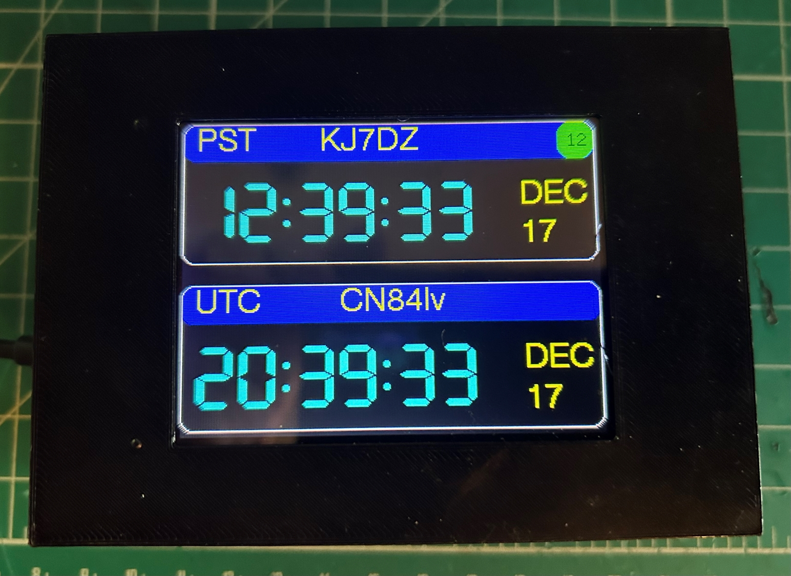

# GPS-Clock

 This GPS clock is based clock original GPS clock project from Bruce Hall's (W8BH) [web site.](http://w8bh.net)
 The orignal arduino sketch came from his [Github site](https://github.com/bhall66/GPS-clock)
 
* Features
	* (3) unique displays (GPS Time, UTC/Local Time, GPS Location and time)
	* Personal CALL sign
	* GRID square location
	* 12/24 Local time
	* 24 UTC time
	* 6-24 VDC operation
	* Useful in the shack, POTA or SOTA
* [Assembly](https://github.com/kj7dz/GPS-clock/blob/main/documentation/Assembly%20instructions%20for%20GPS%20clock.pdf)
* [Software / Programming](documentation/Software.md)

## Hardware
**Bill of Materials**

This is the list of components to build a GPS Clock.  You may already have some of these parts.

| Item | Qty | Part | Link | Approx Price |
| --- | --- | --- | --- | --- |
| 1. | 1 | Printed Circuit Board | [link](mailto:fhoonhout@yahoo.com) | $10.00
| 2. | 1 | STM32F103CBT6 (128K) | [link](https://www.ebay.com/itm/146271505505?_trkparms=amclksrc%3DITM%26aid%3D1110013%26algo%3DHOMESPLICE.SIMRXI%26ao%3D1%26asc%3D264183%26meid%3D204337e245c54480922628bd426e66fa%26pid%3D101196%26rk%3D1%26rkt%3D12%26sd%3D294007193254%26itm%3D146271505505%26pmt%3D1%26noa%3D0%26pg%3D2332490%26algv%3DSimRXIVINativeV2WithSellersOwnItemsFilter&_trksid=p2332490.c101196.m2219&itmprp=cksum%3A146271505505204337e245c54480922628bd426e66fa%7Cenc%3AAQAJAAABEMd7r5mNjkO12hUFN8%252BUjou0r36TWdG4ts9ki5yV37PLn%252BNOULI4btYgHvyZLxyhY1os0HAEAobM6wo2B1iQL8RodZY4QhYqwxpJzfN1Y2q9IGWqLYWGU7hLZZZcQo6A0pcDJ5MUMyM68e2IJlXfrmj5gkJQbKHOHMeW%252BGHOD4g8RAnCugxnh9AfLs%252FK1JdyONgAb4KOVVOwChnBf5hmGfczu5HwcQa%252F7sbMylP2bQjNlSxymquEOsL11suVoyip%252BUpIhUCgfHEuUyfJ%252BZIVIhQW0ZELxZFWykQP3izuMhtAapMwi9298FqRtVNGZZGiHlWfS8onFqnqVZUt5mfckP6ZTEdpL9oTFWlnnk6GKyq1%7Campid%3APL_CLK%7Cclp%3A2332490&epid=14037797509&itmmeta=01JF97E6T3P4EZB37HDWVJAW20) | $ 17.10
| 3. | 1 | 3.2" ILI9341 TFT LCD Display | [link](https://www.amazon.com/DIANN-ILI9341-Display-320x240-Screen/dp/B0BNQD38T2/ref=sr_1_3?crid=25Y7X8C5SN7SN&dib=eyJ2IjoiMSJ9.pePHSofagpEUo7DsQUbYFYq95NsHgDaTkP7PEzlg_Of4-eWST-755toDv8o5hfYtASDvz9A-YoN9szuZupvdv9vjFr6V3jHUM7aUpDldwoC9iFSHctcutB8Y1Pzcz_pnrhesANA1_UFlkAw878D8sIynNk8M7SDz2w6EnE3k5UQsDG2-BVc8aJXMpSKcdXCqPssvwOtNt-DEibVeEeoCO0aFoyNlvv0aPjayNUFa3a8.Kw3Zpo53MkY16LpWvdpszbyXRU5Q2yVnhrcqRO3daHo&dib_tag=se&keywords=3.2%2Binch%2Btft%2Blcd%2Bdisplay&qid=1734403210&sprefix=3.2%2Binch%2Btft%2Blcd%2Bdisplay%2Caps%2C179&sr=8-3&th=1) | $14.00
| 4. | 1 | GPS+BDS Dual Mode module | [link](https://www.amazon.com/DWEII-Dual-Mode-Satellite-Positioning-Replacement/dp/B0B68C1W94/ref=sr_1_4?crid=1SJZ329LMVFMF&dib=eyJ2IjoiMSJ9._va0qNlb7f2IDJS0x_jvVPrL7AoAxPQeVVihj-Kj7w63Y-lAhvsENhaUk2qGioVSEXpg8dJ11FJo3hGKal0pvy4ivjZhakiQssBiJP0G1aQr7wDNVL2gUyq0UziCfaV24wl-X-Swbr4jhkj99z1WCud9yYPi0j94i6-ZiZ8q-sCzwwC02Plp2rmJnrStS_eJYO3ajR1QY0CK1Ixhe_6rV4yz7wGJMS8TThGBhLuo9Uk.UlJ8eqKrvBmdBJ60Sh2zPno8C1NyLaqXtpV0hK0Veo0&dib_tag=se&keywords=NEO-M8N%2BNEO-6M&qid=1734403413&sprefix=neo-m8n%2Bneo-6m%2Caps%2C266&sr=8-4&th=1) | $12.00
| 5. | 1 | MP1584EN DC-DC Buck Converter | [link](https://www.amazon.com/DZS-Elec-Converter-Adjustable-Regulator/dp/B07JWGN1F6/ref=sr_1_3?crid=1TP7YQIN8L1I7&dib=eyJ2IjoiMSJ9.qzXenmHEtYeM6a5LL5Jy8ks7eMaEWOtYzOl0-dvAIPl_lQrE08G3154L4ZD6IVt-xE_PDglWEjkzTi7KkqROzqfFnZ4uamOtoLiOYo2g_PDrvtBpL_4AKBpH4qflSmgZZWmTWpk6Y8zNiMas6VZA-rzTWv1vXrzGY_kDOZOc6GIIZ3WY2rSvewNjVBFsylEqyiAILd2VjR-HFfQJXXpUE1J6BdicZhLSh8EZRalFNHbGoXR4wt_FqblsIB-vp0TdHOEWvyyrFrhCY4qpab6VhTfydOkAsleC6twTb9bv8vRyTG1eSRV0OFlahm4bR2DJQFfUP4MOQbPic3ktyI0W4864XPf8l-pssfXxkc9tlaU.Tku9cc0iVGDI2fENq6Tnzw_Iy3xSvh8bMR_i_inIEF0&dib_tag=se&keywords=eBoot+Mini+MP1584EN+DC-DC+Buck+Converter&qid=1734403872&s=electronics&sprefix=eboot+mini+mp1584en+dc-dc+buck+converter%2Celectronics%2C168&sr=1-3) | $ 7.59
| 6. | 1 | 1N4001 Diode | [link](https://www.amazon.com/FAIRCHILD-SEMICONDUCTOR-1N4001-STANDARD-pieces/dp/B00LQPV2KA/ref=sr_1_11?crid=35RZE8AMM8FLD&dib=eyJ2IjoiMSJ9.YIyKdXQ-tAcqKFdFC4apoVyyy4hhCiVhEKRbsBjNzdN8UmshAoSr_om29aO2XHtv1jWswWE-aLDFF8neAhYVoyniprd8mfz63PyYO1EtQBlZUSGRgUDdSiQ0pEFjJlcStWzTGHZyFgan1oebbr5IO0ofydl39xA7KqVXlF8gMCyKDj_03Jzu9YEgOGuAHh_AKFDK58Sq2lx675flNe7oN-P4qamQNbVbALbBHCTxpig.AJajibu7C6TtfNJmCgaxXbKs3J3a-QKLlLWRxxPGGck&dib_tag=se&keywords=1n4001&qid=1734403673&sprefix=1n4001+%2Caps%2C236&sr=8-11) | $ 4.94
| 7. | 2 | 40 pin female socket pin header | [link](https://www.amazon.com/ZYAMY-2-54mm-Female-Straight-Connector/dp/B0778F2MLW/ref=sr_1_8?crid=3QEPIJ1YIFKJB&dib=eyJ2IjoiMSJ9.Bja9ojs2M2o-0J9QBJTi7Sib_aGZMBoOTm7zQhg0cCQ74UtIWW1EP2BLMlkG-O3ykXqJ_iCVaUs-7dMXGJNnuAPL82pEwSSbBXtJp7sYZYB7VS1gAVXXfHFU_yI9lk6aS57aKSA8Go2lZR88_z2AmPnimbxZpXbChki8ibasL80-1gXBvqCgqKLvPbbT4vMm7qz8ltPX0_obPuOVuT3eRv9yiTzCyXfFObM9hlY8xYo.HIcKxuQeNxLbwz_iKFSo1Zhm-aOTJHPrfAC6FcKzoS0&dib_tag=se&keywords=female+header+pins+1x40&qid=1734403548&sprefix=female+header+pins+1x40%2Caps%2C201&sr=8-8) | $ 5.98 
| 8. | 1 | 40 pin male pin header | [link](https://www.amazon.com/MCIGICM-Header-2-45mm-Arduino-Connector/dp/B07PKKY8BX/ref=sr_1_3?crid=1WERD56X0O7QX&dib=eyJ2IjoiMSJ9.ta8Z8Op10qrZHbS0nd10UJSeSsjI8ShuLcBIB1Hp-oOOXc6Jt4kb5rvcHPXNI5s2-ZQRC6FisLpEVCHog2mXETq5IizGwtFm37zy-Yo8LmP3JSdrFfo6TjXfHQUOuEQLEIK7yZ0w3QCM3Z0oa7amVmcUM3eTNoBxAVLOj8KXuNoyEgjujv9WJsd9JydEp2pg1TkKDLQI7_O5m9xryIqYh04dWDIuPrfkqmF1s3JWKn45JrEfRmjEiyIt_zsutxde34_i4gFe2wNZ0yJmQlQhAeAOzPtjS-PP-XdaKzhpM8Rawskn9p0Hsg7-WiPd2__8oOvMLl-R92qBwRDYkyqSVO0n8TPrAsdnG0_G-IAQ9g8.5kgpTNjLMtLvbV0Wj2CYNJu5MLoxrS_-VyHmqJKkfZ0&dib_tag=se&keywords=male+pin+header&qid=1734404042&s=electronics&sprefix=male+pin+header%2Celectronics%2C191&sr=1-3) | $ 5.98 
| 9.   | 1 | 5.5 / 2.1mm power plug/socket | [link](https://www.amazon.com/dp/B08SJM2G52?ref=ppx_yo2ov_dt_b_fed_asin_title) | $10.90
| 10.  | 1 | ST-link V2 USB programmer | [link](https://www.amazon.com/HiLetgo-Emulator-Downloader-Programmer-STM32F103C8T6/dp/B07SQV6VLZ/ref=sr_1_1_sspa?crid=2YNPVA66W8J3U&dib=eyJ2IjoiMSJ9.qqFD5Om07FWVxJ7mURnZvPpK6rtpUdy6Rl2Wp2nDTWrQUIQTsD49-dYAYdIp_YmHTtKGIiT4ksUOlBfdJspv_qb8b6UzsUIIx3dNi5Ipnkp3XyQ2dTub7WLHOvkA7NQH1lxDp5Aqp7wP_2rYEk4e0SOsENj_U770PiuukFvbBDQ9UDZyNEqwaHOXgCPK7HhZP6CXMkZXOC0FjiCnAvrkq8zYK2EDDrgtCVUIZBlQ9sE.29pe5Xmxd8adZRCZaG6TbFNp0-vnzOoCWU99m4w2X_g&dib_tag=se&keywords=stlink+v2+usb&qid=1734542614&sprefix=stlink+v2+usb%2Caps%2C205&sr=8-1-spons&sp_csd=d2lkZ2V0TmFtZT1zcF9hdGY&psc=1) | $ 9.49
| 11. | 1 | 3D Printed Case | [link](https://www.thingiverse.com/thing:6877107) | Thingiverse

**Fully assembled GPS Clock and KIT are available** _(includes programming)_

**Material details**
* **PCB** - The PCB can be order directly from KJ7DZ. _(includes shipping)_
* **STM32** - The STM32 controller comes in 32K, 64K or 128K versions. Sketch just fits into 64k of ROM flash.
	* STM32F103C**6**T6 - **32K**
	* STM32F103C**8**T6 - **64K**
	* STM32F103C**B**T6 - **128K**
* **3.2" TFT LCD Display** - Be sure the display supports 3.3V and touch screen.
* **GPS module** - In some situations the included GPS antenna may not work. A [28db High Gain antenna](https://www.amazon.com/Ceramic-Navigation-Receiver-Tracking-Interface/dp/B0C3H6BKHC/ref=sr_1_8?crid=1I0MV4RVO0TNZ&dib=eyJ2IjoiMSJ9.lL4ooPKPGgA5h5VuxkmYvPUl_FR0r55a4stbuSNrFrytdNhvfazz2xxBdv-gezQpTJsOEfH16PXE0if69B1TT6zHNGZQUE7t9Eta2Z3GC1L8NOysKiwpZ-r_OSZ2yOuxrnpGSQvcXJfKFUqg0jCQKHx9CFF26VYBR1eyED0ArIxkJvYULcBpoCDrRfGzyM8ITipxuHB5EvP7TTjLEX67G2q9KkAwkfmqcfR03G7-rsM.aEtePunQGbgx7Ad7t4G7SemYj-KpGrESdnYNR3LeeE8&dib_tag=se&keywords=GPS+32dbi+antenna&qid=1734466215&sprefix=gps+32dbi+antenna%2Caps%2C152&sr=8-8) maybe needed.
* **DC-DC Buck converter** - It is **CRITICAL** to set the buck converter to **3.3 VDC** output.
* **1N4001 diode** - The diode is for reverse voltage protection.  A similar diode can be used.
* **Power connectors** - The socket wires can be solder directly to the PCB or use a molex connector.

**Contributers**

| Bruce | W8BH |
| --- | --- |
| Ken | WB2ART |
| Frank | KJ7DZ |
	
	